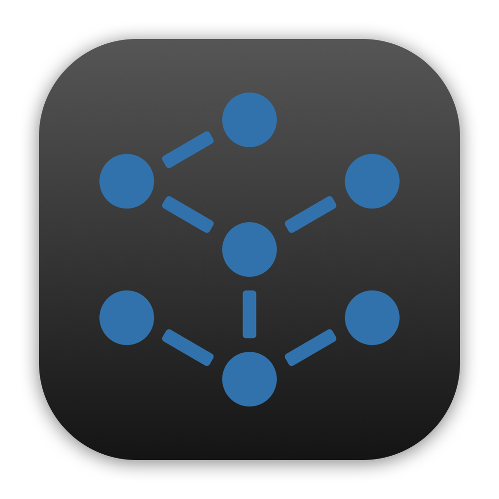

<p align="center">
  
</p>

<h1 align="center">ADAR - Architecture Displayer in AR</h1>

<p align="center">
  <a href="https://github.com/gf0x/ADAR/actions/workflows/ci.yml"></a>
  <a href="https://codecov.io/gh/gf0x/ADAR"></a>
  <a href="LICENSE"></a>
  
  
  
</p>

ADAR analyses Swift projects and visualises their architecture as an interactive 3D graph in augmented reality. This repository is the canonical source release.

The project is source-available under [CC BY-NC-SA 4.0](LICENSE). Commercial use is not permitted. The iOS viewer source is included; signed app binaries are distributed privately.

## Install

Add the package to a Swift package or Xcode project:

```swift
.package(url: "https://github.com/gf0x/ADAR.git", from: "0.1.0")
```

Available source-built products:

| Product | Purpose |
|---|---|
| `ADAR2LintPlugin` | Build-tool plugin that emits diagnostics from an existing `.adar` model |
| `GenerateADARModel` | Command plugin that generates `.adar` models |
| `adar2-lint` | Standalone diagnostics executable |
| `ADAR2ModelBuilder` | Standalone analyzer and model-generation executable |

Enable linting for a target:

```swift
.target(
    name: "MyTarget",
    plugins: [.plugin(name: "ADAR2LintPlugin", package: "ADAR")]
)
```

Generate a model from a package checkout:

```bash
swift package generate-adar-model
```

## Components

| Package | Purpose |
|---|---|
| `ADAR2Shared` | Codable graph and bug-report models |
| `ADAR2Core` | Graph implementations and force-directed simulation |
| `ADAR2SwiftAnalyzer` | Symbol graph and SwiftSyntax analysis |
| `ADAR2BugDetector` | Structural anomaly detection |
| `ADAR2NaiveForceDirectedVisualizer` | All-pairs force-directed layout |
| `ADAR2AdvancedForceDirectedVisualizer` | Barnes-Hut octree layout |
| `ADAR2MLVisualizer` | CoreML-assisted layout |
| `ADAR2ModelBuilder` | Model-generation CLI |
| `ADAR2LintPlugin` | SwiftPM integration and linter |
| `ADAR2` | iOS ARKit and SceneKit viewer |

## Configuration

The linter reads `.adarconfig` from the project root:

```json
{
  "rules": {
    "high_degree_node": "warning",
    "low_cohesion_edge": "warning",
    "cycle_edge": "error",
    "edge_crossing": "ignore"
  }
}
```

Supported severities are `warning`, `error`, and `ignore`. Source annotations can suppress findings:

```swift
// adar_disable:next cycle_edge
final class IntentionalCycle {}
```

## Development

Run package tests:

```bash
for package in ADAR2Shared ADAR2Core ADAR2BugDetector \
  ADAR2AdvancedForceDirectedVisualizer ADAR2NaiveForceDirectedVisualizer \
  ADAR2MLVisualizer ADAR2SwiftAnalyzer; do
  swift test --package-path "$package"
done
swift build
```

Build the unsigned iOS simulator app:

```bash
xcodebuild -workspace ADAR2.xcworkspace -scheme ADAR2 \
  -sdk iphonesimulator CODE_SIGNING_ALLOWED=NO build
```

See [NOTICE.md](NOTICE.md) for bundled asset provenance and [CONTRIBUTING.md](CONTRIBUTING.md) before submitting changes.
